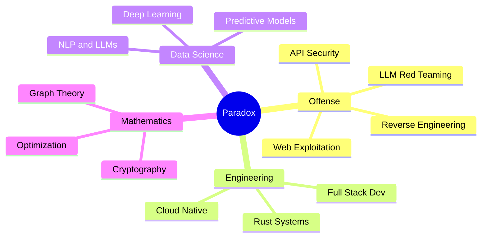

<div align="center">

<!-- ═══════════════════════ THE PARADOX MANIFESTO ═══════════════════════ -->

$$\huge \mathbb{P}(\text{aradox}) = \left\\{ x \in \mathbb{R}^n \;\middle|\; \text{Developer}(x) \wedge \text{Hacker}(x) \wedge \text{Scientist}(x) \wedge \text{Mathematician}(x) \right\\}$$

<br/>


<a href="https://github.com/i-am-paradox">
  
</a>

<br/>

<a href="https://github.com/i-am-paradox?tab=repositories"></a>
<a href="https://github.com/i-am-paradox?tab=stars"></a>


</div>

<br/>

<!-- ═══════════════════════ IDENTITY ═══════════════════════ -->

<table align="center">
<tr>
<td width="55%">

### `$ cat /etc/paradox.conf`

```yaml
identity:
  name: Paradox
  type: Multi-Dimensional Engineer
  location: India

dimensions:
  hacker:
    role: Security Researcher & Red Team Operator
    focus: [API Exploitation, LLM Red Teaming, 
           OSINT Automation, Reverse Engineering]
    
  architect:
    role: Full-Stack Systems Engineer
    focus: [Distributed Systems, CLI Security Tools,
           Cloud Infrastructure, Holographic UIs]

  scientist:
    role: ML Engineer & Data Scientist
    focus: [Deep Learning, NLP, LLM Fine-tuning,
           Predictive Modeling, RAG Systems]

  mathematician:
    role: Applied Mathematician
    focus: [Cryptographic Protocols, Graph Theory,
           Optimization Algorithms, Chaos Theory]

languages: [Rust, Python, Go, TypeScript, C++, Bash]
motto: "∀ problems ∃ solutions ∈ my mind"
```

</td>
<td width="45%">

### The Paradox Theorem

> *"A system can only be truly secured by one who has first mastered breaking it. At the intersection of mathematics and exploitation — that is where real security lives."*

<br/>

**Actively Training:**

$$\nabla_\theta J(\theta) = \frac{1}{m}\sum_{i=1}^{m}\nabla_\theta\mathcal{L}(f_\theta(x^{(i)}), y^{(i)})$$

<sub>Gradient descent over threat landscapes.</sub>

<br/>



</td>
</tr>
</table>

<br/>

<!-- ═══════════════════════ TECH ARSENAL ═══════════════════════ -->

<h2 align="center">⚙️ The Arsenal</h2>

<div align="center">

**`Systems & Cloud`**

<a href="#"></a>
<a href="#"></a>
<a href="#"></a>
<a href="#"></a>
<a href="#"></a>
<a href="#"></a>
<a href="#"></a>
<a href="#"></a>

<br/>

**`Frameworks & Data`**

<a href="#"></a>
<a href="#"></a>
<a href="#"></a>
<a href="#"></a>
<a href="#"></a>
<a href="#"></a>

<br/>

**`Offensive Security`**&nbsp;&nbsp;&nbsp;


**`AI / ML / Data`**&nbsp;&nbsp;&nbsp;


</div>

<br/>

<!-- ═══════════════════════ STATS ═══════════════════════ -->

<h2 align="center">📈 Field Metrics</h2>

<div align="center">


</div>

<br/>

<div align="center">
  
</div>

<br/>

<!-- ═══════════════════════ SNAKE ═══════════════════════ -->

<div align="center">

$$\text{Contribution}(t) = \int_{t_0}^{t} \text{commit}(\tau) \cdot e^{-\lambda(t-\tau)} \, d\tau$$

<picture>
  <source media="(prefers-color-scheme: dark)" srcset="https://raw.githubusercontent.com/i-am-paradox/i-am-paradox/output/github-snake-dark.svg" />
  <source media="(prefers-color-scheme: light)" srcset="https://raw.githubusercontent.com/i-am-paradox/i-am-paradox/output/github-snake.svg" />
  
</picture>

</div>

<br/>

<!-- ═══════════════════════ FEATURED ═══════════════════════ -->

<h2 align="center">🏴‍☠️ Featured Operations</h2>

<div align="center">
  <a href="https://github.com/i-am-paradox/api-checker-v1">
    
  </a>
  <a href="https://github.com/i-am-paradox/tbs-sct-recon">
    
  </a>
  <a href="https://github.com/i-am-paradox/cc-cheacker">
    
  </a>
  <a href="https://github.com/i-am-paradox/resume">
    
  </a>
</div>

<br/>

<!-- ═══════════════════════ FINAL ═══════════════════════ -->

<div align="center">


<br/><br/>

$$\large \boxed{ \forall \; S \in \text{Systems}, \quad \exists \; v \in S : \quad \mathbb{P}[\text{exploit}(v) \mid \text{Paradox}] \to 1 }$$

<sub>*"For every system S, there exists a vulnerability v such that the probability of exploitation, given Paradox, approaches certainty."*</sub>

<br/><br/>


</div>
