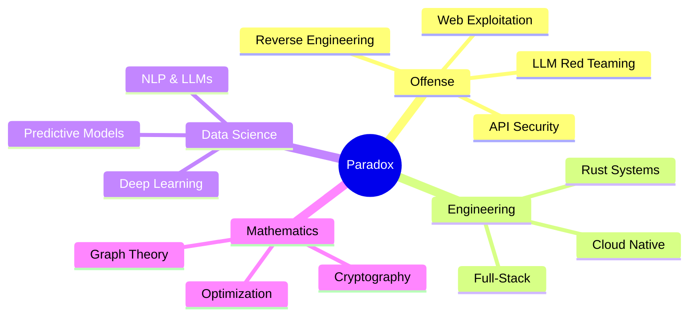

<div align="center">

<!-- ═══════════════════════════════════════════ -->
<!--          THE PARADOX MANIFESTO             -->
<!-- ═══════════════════════════════════════════ -->

<!-- PHASE 1: THE MATHEMATICAL IDENTITY -->

$${\color{violet} \boxed{ \mathbb{P}(x) = \underbrace{\sum_{k=0}^{\infty} \frac{(\text{Code})^k}{k!}}_{\text{Developer}} \cdot \underbrace{e^{i\pi\text{(Exploit)}}}_{\text{Hacker}} \cdot \underbrace{\nabla_{\theta}\mathcal{L}(\theta)}_{\text{Data Scientist}} \cdot \underbrace{\oint_{\partial\Omega} \omega}_{\text{Mathematician}} }}$$

<br/>

<!-- PHASE 2: THE HEADER — Unique "Soft" gradient, not generic red/blue -->


<!-- PHASE 3: THE SOUL — Refined typing with class -->
<a href="https://github.com/i-am-paradox">
  
</a>

<br/>

<!-- BADGES — Elegant purple theme -->
<a href="https://github.com/i-am-paradox?tab=repositories"></a>
<a href="https://github.com/i-am-paradox?tab=stars"></a>


</div>

<br/>

<!-- ═══════════════════════════════════════════ -->
<!--          PHASE 4: THE IDENTITY MATRIX      -->
<!-- ═══════════════════════════════════════════ -->

<div align="center">

$$\large \text{Identity} = \begin{bmatrix} \text{Developer} & \text{Hacker} \\\\ \text{Data Scientist} & \text{Mathematician} \end{bmatrix} \Rightarrow \det(\text{Paradox}) \neq 0$$

</div>

<br/>

<table align="center">
<tr>
<td width="50%">

### 🧬 `$ cat /etc/paradox.conf`

```yaml
name: "Paradox"
class: "Multi-Dimensional Engineer"

roles:
  - Security Researcher & Red Team Operator
  - Full-Stack Systems Architect
  - Machine Learning Engineer
  - Applied Mathematician

languages:
  primary: [Rust, Python, Go, TypeScript]
  secondary: [C++, Bash, SQL, LaTeX]

interests:
  offensive: [API Exploitation, LLM Red Teaming, 
              OSINT Automation, C2 Development]
  building:  [Distributed Systems, CLI Tools,
              Neural Networks, Holographic UIs]
  math:      [Cryptography, Graph Theory,
              Chaos Theory, Topology]

motto: "∀ problems ∃ solutions ∈ my mind"
```

</td>
<td width="50%">

### 📐 The Paradox Theorem

> *"A system can only be truly secured by someone who has first learned to break it. The intersection of mathematics and exploitation is where real security lives."*

<br/>

**Currently working on:**

$$\mathcal{L}(\theta) = -\frac{1}{N}\sum_{i=1}^{N} \left[ y_i \log(\hat{y}_i) + (1-y_i)\log(1-\hat{y}_i) \right]$$

<sub>Training models to detect what humans cannot see.</sub>

<br/>



</td>
</tr>
</table>

<br/>

<!-- ═══════════════════════════════════════════ -->
<!--        PHASE 5: THE INFINITE ARSENAL       -->
<!-- ═══════════════════════════════════════════ -->

<h2 align="center">
  
${\color{violet}\text{⟨ The Infinite Arsenal ⟩}}$

</h2>

<div align="center">

**`Systems & Low Level`**

<a href="#"></a>
<a href="#"></a>
<a href="#"></a>
<a href="#"></a>
<a href="#"></a>
<a href="#"></a>
<a href="#"></a>
<a href="#"></a>

<br/>

**`Frameworks & Data`**

<a href="#"></a>
<a href="#"></a>
<a href="#"></a>
<a href="#"></a>
<a href="#"></a>
<a href="#"></a>
<a href="#"></a>

<br/>

**`Offensive Security`**


**`AI/ML & Data Science`**


</div>

<br/>

<!-- ═══════════════════════════════════════════ -->
<!--       PHASE 6: THE FIELD EQUATIONS         -->
<!-- ═══════════════════════════════════════════ -->

<h2 align="center">

${\color{violet}\text{⟨ Activity Field Equations ⟩}}$

</h2>

<div align="center">


</div>

<br/>

<div align="center">
  
</div>

<br/>

<!-- ═══════════════════════════════════════════ -->
<!--     PHASE 7: THE NEURAL ALGORITHM          -->
<!-- ═══════════════════════════════════════════ -->

<div align="center">

$$\text{Contribution}(t) = \int_{t_0}^{t} \text{commit}(\tau) \cdot e^{-\lambda(t - \tau)} \, d\tau$$

<sub>☝️ Exponentially weighted contribution density function — my commits, visualized as a neural snake traversing the contribution hyperplane.</sub>

<br/><br/>

<picture>
  <source media="(prefers-color-scheme: dark)" srcset="https://raw.githubusercontent.com/i-am-paradox/i-am-paradox/output/github-snake-dark.svg" />
  <source media="(prefers-color-scheme: light)" srcset="https://raw.githubusercontent.com/i-am-paradox/i-am-paradox/output/github-snake.svg" />
  
</picture>

</div>

<br/>

<!-- ═══════════════════════════════════════════ -->
<!--       PHASE 8: FEATURED OPERATIONS         -->
<!-- ═══════════════════════════════════════════ -->

<h2 align="center">

${\color{violet}\text{⟨ Featured Operations ⟩}}$

</h2>

<div align="center">
  <a href="https://github.com/i-am-paradox/api-checker-v1">
    
  </a>
  <a href="https://github.com/i-am-paradox/tbs-sct-recon">
    
  </a>
  <a href="https://github.com/i-am-paradox/cc-cheacker">
    
  </a>
  <a href="https://github.com/i-am-paradox/resume">
    
  </a>
</div>

<br/>

<!-- ═══════════════════════════════════════════ -->
<!--         PHASE 9: THE FINAL THEOREM         -->
<!-- ═══════════════════════════════════════════ -->

<div align="center">

$$\large \boxed{ \forall \text{ systems } S, \quad \exists \text{ vulnerability } v \in S \quad \text{s.t.} \quad \mathbb{P}(\text{exploit} \mid \text{Paradox}) \rightarrow 1 }$$

<br/>

<sub>🔮 *"For every system S, there exists a vulnerability v such that the probability of exploitation, given Paradox, approaches certainty."*</sub>

<br/><br/>


</div>

<br/>

<!-- FOOTER -->

